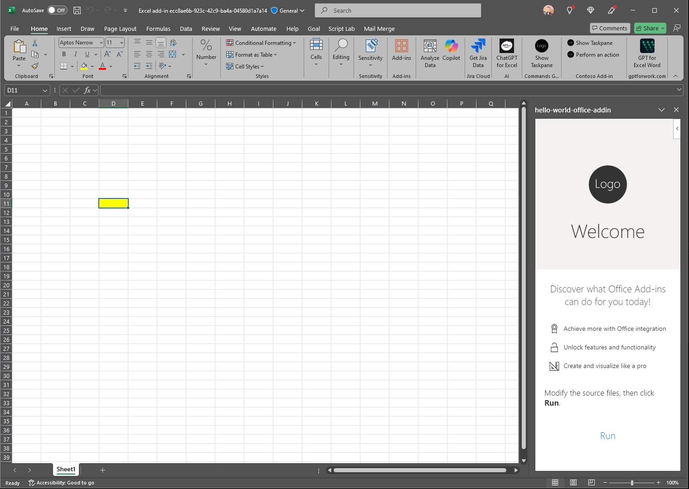

# Getting Started with Hello World Office Add-in Sample

Office add-ins are integrations built by third parties into Office by using our web-based platform.

Now you have the ability to create a single unit of distribution for all your Office applications by using the same manifest format and schema, based on the current JSON-formatted MetaOS manifest.

## This sample illustrates

- How Office add-in of Word, Excel, Powerpoint, Outlook share the same JSON manifest in one project.

## Prerequisites to use this sample

- [Node.js](https://nodejs.org/), supported versions: 18, 20
- Edge installed for debugging Office add-in.
- Office for Windows: Beta Channel. Follow [this link](https://github.com/OfficeDev/TeamsFx/wiki/How-to-switch-Outlook-client-update-channel-and-verify-Outlook-client-build-version) for information about how to update channels and check your Office client build version.
- An M365 account. If you do not have M365 account, apply one from [M365 developer program](https://developer.microsoft.com/en-us/microsoft-365/dev-program)
- [Teams Toolkit Visual Studio Code Extension](https://aka.ms/teams-toolkit) version 5.0.0 and higher or [Teams Toolkit CLI](https://aka.ms/teams-toolkit-cli)

## Minimal path to awesome

### Debug Office add-in

- Please note that the same M365 account should be used both in Teams Toolkit and Office Applications (Word, Excel, Powerpoint, Outlook).
- From Visual Studio Code only: use the `Run and Debug Activity Panel` in Visual Studio Code, select `Debug in Excel Desktop (Edge Chromium)`, and click the `Run and Debug` green arrow button. Please run VSCode as administrator if localhost loopback for Microsoft Edge Webview hasn't been enabled. Once enbaled, administrator priviledge is no longer required.

   

   Once the Excel app is open, you can select the option to show a task pane.
   

   The taskpane should look as shown in the following image.
   

   Other Office Applications share the same behavior.

### Edit the manifest

You can find the app manifest in `./appPackage` folder. The folder contains one manifest file:

- `manifest.json`: Manifest file for Office add-in running locally.

You may add any extra properties or permissions you require to this file. See the [schema reference](https://docs.microsoft.com/en-us/microsoftteams/platform/resources/schema/manifest-schema) for more information.

### Deploy and publish

Currently unified manifest of Office add-in is in public preview, so it does not support deploy and publish.

### Validate manifest file

To check that your manifest file is valid:

- From Visual Studio Code: open the command palette and select: `Teams: Validate Application` and select `Validate using manifest schema`.
- From Teams Toolkit CLI: run command `teamsapp validate` in your project directory.

## Version History

|Date| Author| Comments|
|---|---|---|
|Dec 06, 2024 | hermanwen | Init sample |

## Feedback

We really appreciate your feedback! If you encounter any issue or error, please report issues to us following the [Supporting Guide](https://github.com/OfficeDev/TeamsFx-Samples/blob/dev/SUPPORT.md). Meanwhile you can make [recording](https://aka.ms/teamsfx-record) of your journey with our product, they really make the product better. Thank you!